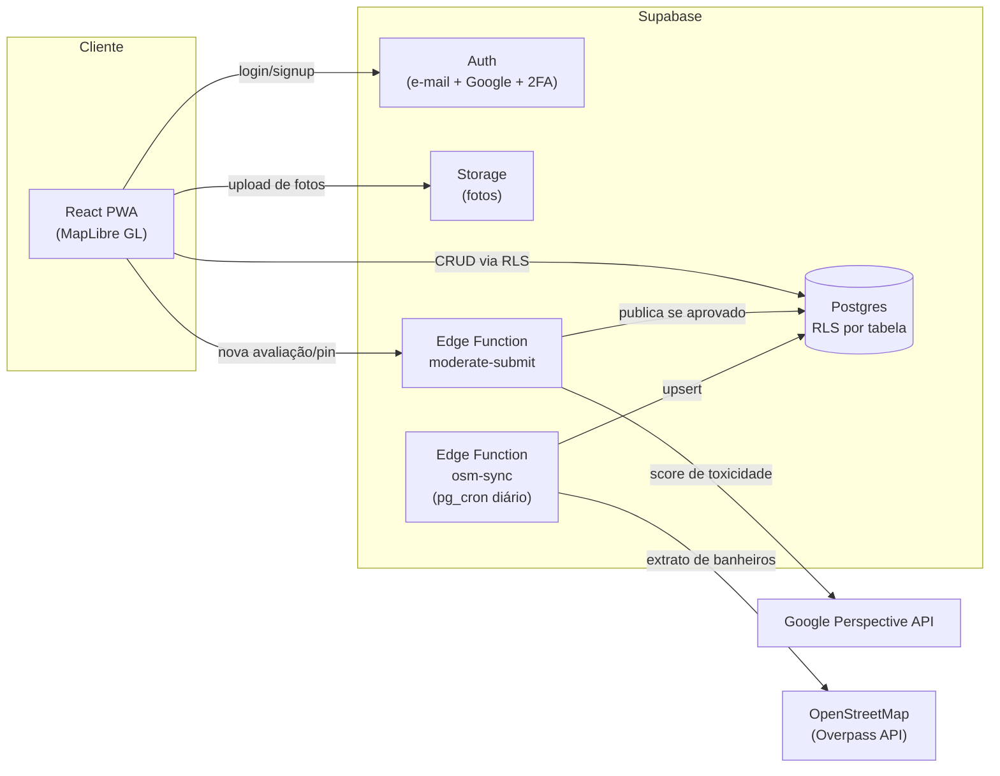

# 🚻 Banheiros

**Encontre e avalie banheiros públicos perto de você.**

Um PWA mobile-first que mapeia banheiros acessíveis ao público (parques, praças, shoppings, postos, estabelecimentos comerciais) e deixa a comunidade avaliar o que realmente importa na hora de decidir se vale a pena ir até lá: acessibilidade, iluminação, cheiro, manutenção e limpeza.

[](https://github.com/crespo/banheiros/actions/workflows/ci.yml)


---

## O problema

Quem está na rua e precisa de um banheiro não tem como saber onde existe um acessível ao público, se está aberto, se é pago e em que condições está. A informação existe de forma fragmentada: o OpenStreetMap tem localizações, mas sem qualidade nem condições reais. Hoje a solução é perguntar, torcer ou consumir algo num comércio só para poder usar o banheiro.

O Banheiros existe para resolver isso: dados de localização reais (via OSM), avaliações da comunidade em critérios que importam de verdade, e moderação automática para manter o conteúdo confiável.

## ✨ Funcionalidades

**Mapa e descoberta**
- Mapa centrado na sua localização (ou numa região padrão, se a permissão for negada), com pins do OpenStreetMap e cadastrados pela comunidade.
- Filtro por categoria (Todos / Público / Comercial / Pago) e busca por endereço.
- Aviso claro quando o usuário está fora da área de cobertura, sem mapa vazio silencioso.

**Detalhe e avaliação**
- Bottom sheet com nome, categoria, endereço, status "Aberto agora" / "Fechado agora" e nota geral.
- Avaliação em 5 critérios fixos (acessibilidade, iluminação, odor, manutenção, limpeza), numa escala de 1 a 3, com comentário obrigatório.
- Escolha entre publicar anônimo ou com o `@usuario`. Uma avaliação por pessoa por banheiro: reavaliar edita a existente.
- Reporte de problemas num pin, direto do detalhe.

**Comunidade**
- Cadastro de novos banheiros pela comunidade, com moderação antes de aparecer no mapa.
- Favoritos, sincronizados na conta entre aparelhos.

**Conta e confiança**
- Login com e-mail/senha (confirmação obrigatória) ou Google.
- Identidade por username único, com opção de mostrar ou esconder em cada avaliação.
- Exclusão de conta (LGPD): remove dados pessoais, mantém avaliações como "Usuário anônimo".
- 2FA por TOTP opcional, com QR code e backup codes.
- Moderação automática de texto server-side antes de qualquer conteúdo publicar.
- Interface em PT e EN, com troca de idioma disponível antes do login.

## 🏗️ Stack técnica

| Camada | Tecnologia | Por quê |
|---|---|---|
| Frontend | React 19 + Vite + TypeScript | SPA leve, build rápido ([ADR-0002](docs/adr/0002-react-vite-spa.md)) |
| Plataforma | PWA (instalável, sem app store) | [ADR-0001](docs/adr/0001-plataforma-web-pwa.md) |
| Mapa | MapLibre GL + tiles OSM | Open source, sem vendor lock-in de mapas |
| Backend | Supabase (Postgres + Auth + Storage + Edge Functions) | Auth pronta, RLS no banco, funções serverless ([ADR-0003](docs/adr/0003-backend-supabase.md)) |
| Dados de localização | Extrato sincronizado do OpenStreetMap via `osm-sync` | Evita rate limit da Overpass API em tempo real ([ADR-0004](docs/adr/0004-osm-extrato-sincronizado.md)) |
| Moderação | Google Perspective API | Detecção automática de toxicidade, ameaça e ataques ([ADR-0005](docs/adr/0005-moderacao-perspective-api.md)) |
| Testes | Vitest + Testing Library (frontend/functions) + pgTAP (banco) | |
| Deploy | Vercel (frontend) + Supabase Cloud (backend) | Runbook completo em [docs/DEPLOY.md](docs/DEPLOY.md) |

## 🗺️ Arquitetura



## 📂 Estrutura do projeto

```
src/
├── *Screen.tsx        # Telas (Auth, Map, Favorites, Profile, ...)
├── BathroomDetailSheet.tsx
├── ReviewComposer.tsx
├── i18n/               # Dicionário PT/EN
├── lib/                # Cliente Supabase e afins
└── styles/             # Design tokens (paleta, tipografia)

supabase/
├── migrations/         # Schema, RLS, funções SQL
├── functions/          # Edge Functions (moderate-submit, osm-sync, delete-account)
└── tests/              # Testes pgTAP do banco

docs/
├── prd/                # Product Requirements Document
├── adr/                # Architecture Decision Records
├── specs/              # Specs por funcionalidade
└── DEPLOY.md           # Runbook de deploy em produção
```

## 🚀 Rodando localmente

**Pré-requisitos:** Node 24+, [Supabase CLI](https://supabase.com/docs/guides/cli) e Docker (para o Supabase local).

```bash
# 1. Clonar e instalar dependências
git clone https://github.com/crespo/banheiros.git
cd banheiros
npm install

# 2. Subir o Supabase local (Postgres + Auth + Storage + migrations)
supabase start

# 3. Configurar variáveis de ambiente
cp .env.example .env.local
# .env.example já aponta para as credenciais padrão do Supabase local

# 4. Rodar o app
npm run dev
```

### Scripts disponíveis

| Comando | O que faz |
|---|---|
| `npm run dev` | Sobe o app em modo desenvolvimento |
| `npm run build` | Type-check (`tsc --noEmit`) + build de produção |
| `npm test` | Roda a suíte Vitest (frontend + Edge Functions) |
| `npm run lint` | ESLint |
| `supabase test db` | Testes pgTAP do schema e das políticas de RLS |

## 📖 Documentação

- **[PRD](docs/prd/2026-08-02-banheiros-mvp.md)**: problema, requisitos e critérios de aceite
- **[ADRs](docs/adr/)**: decisões de arquitetura e por quê
- **[Specs](docs/specs/)**: especificação funcional detalhada, por feature
- **[Runbook de deploy](docs/DEPLOY.md)**: passo a passo para produção

## 🧭 Cobertura e roadmap

A v1 cobre apenas **Maceió**, já que o sync com o OpenStreetMap está limitado a essa região. Fora dela, o app avisa que a cobertura ainda não chegou lá em vez de mostrar um mapa vazio.

Fora de escopo por decisão, por ora: ocupação em tempo real, navegação turn-by-turn, monetização e painel de moderação manual. A v1 aposta em moderação 100% automática.
